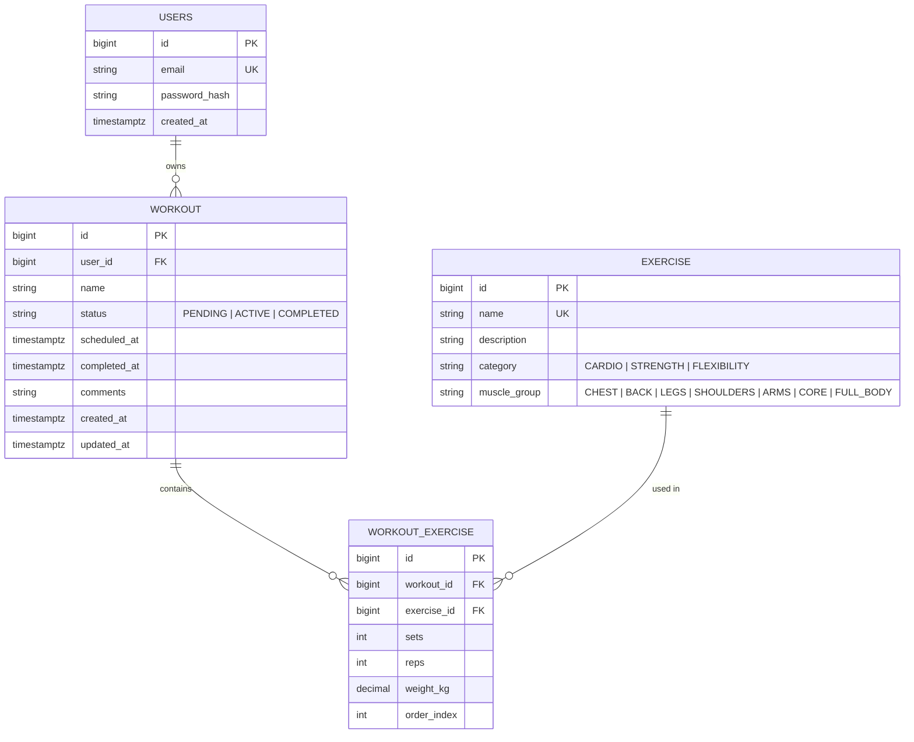

# Rhys' Workout Tracker

A RESTful backend API for a workout tracker. Users sign up, log in, build workout plans from a seeded library of exercises, schedule workouts, log progress, and generate reports on past workouts.

Based on the [roadmap.sh Workout Tracker](https://roadmap.sh/projects/fitness-workout-tracker) project brief.

## Tech stack

- Java 21, Spring Boot 3 (Web, Data JPA, Security, Validation)
- PostgreSQL, with schema migrations managed by Flyway
- JWT authentication (stateless), passwords hashed with BCrypt
- OpenAPI 3 docs via springdoc-openapi (Swagger UI at `/swagger-ui.html`)
- JUnit 5, Mockito, Spring Boot Test, Testcontainers
- Maven, Docker Compose, GitHub Actions

## Data model

A user has many workouts; a workout has many workout exercises; each workout exercise references one exercise from the seeded library.



## Running locally

Requires Java 21 and Docker.

```bash
cp .env.example .env              # database credentials
docker compose up -d db           # start Postgres
./mvnw spring-boot:run            # run the app on http://localhost:8080
```

## Running tests

Integration tests start a real Postgres with Testcontainers, so Docker must be running.

```bash
./mvnw test                       # unit + integration tests
./mvnw verify                     # full build, tests, and checks
```

## Authenticating in Swagger UI

TODO

## Example requests

TODO

## Design decisions

TODO
